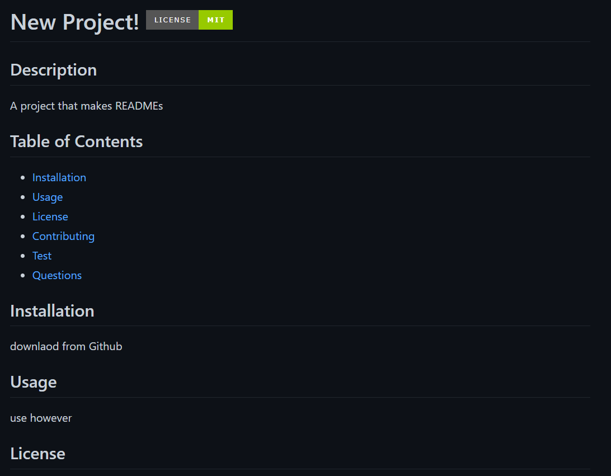

# A professional README generator

Complete homework portfolio project with HTML, CSS and Javascript files to fit the assessment criteria.
A README generator that makes a structured README with external links

Made by Ethan D'Mello
Github: https://github.com/EthanDMello
LinkedIn: https://www.linkedin.com/in/ethan-d-mello-0351ab21b/

Link to deployed application:
**No HTML to deploy.**

Application screenshot:

